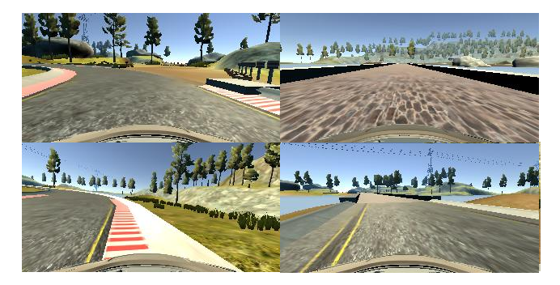
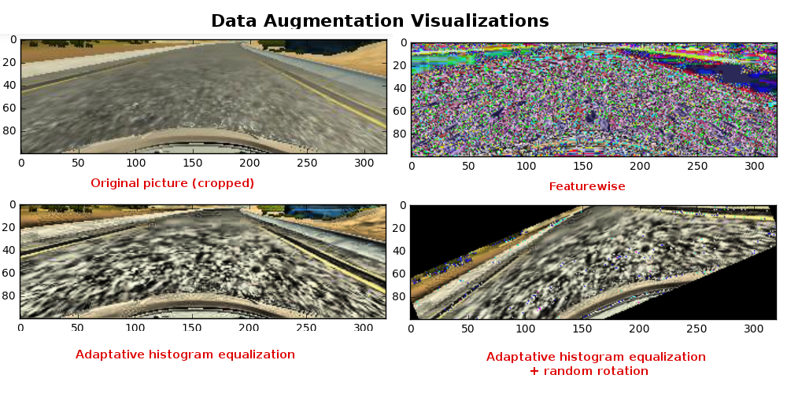
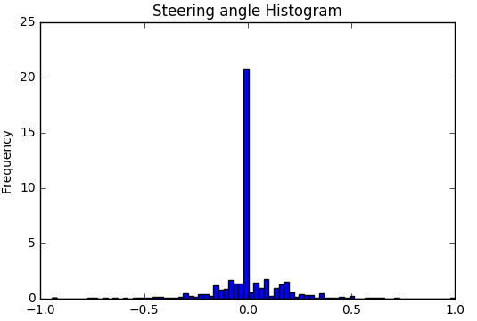
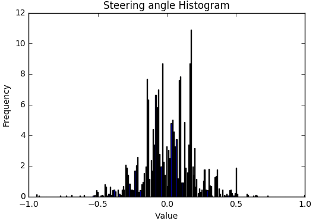

# Behavioral Cloning  
This project is developed for the Self-Driving Car Nanodegree by Udacity. The goal is to train a Convolutional Neural Network that is able to predict steering angles in order to drive a car in a simulator.  

## Choosing the Data

In order to get the data, we need to capture a "smooth" running in the simulator. It is important to get smooth dataset because if the training data has samples where the car is zigzaggint, that behavior will also be cloaned by the network (and will be even worse). A good data set will keep the car in the center of the road most of the time. 
Even though we do not want pictures that teach our car to go to the lanes, it is important to record some pictures where the car in on the lanes and steering in order to go back to the center, this will teach the car to recover from situation where it goes over the lanes. This is achieved by intentionally steering the car over the lanes and recording only when the car is going back to the center.  

The original number of samples is 8036 from a smooth drive + 920 for recovery.   

*Note: the number of samples mentiones above, is before data augmentation*

## Preprocess the Data

For data preprocessing, the pictures are cropped in order to remove the background and keep the road. Three data augmentation techniques are used, resulting in 3 training datasets.
The techniques applied are:  
- Adaptative histogram equialization.  
- Adaptative histogram equialization + random_rotations.  
- Featurewise.

For validation dataset, Adaptative histogram equialization + random_rotations is applied.  
Normalization is not applied here, the normalization is applied per batch during training.

Here is the justification for the choosen techniques:  

**Adaptive histogram equalization**  
Adaptive histogram equalization (AHE) is a computer image processing technique used to improve contrast in images. It differs from ordinary histogram equalization in the respect that the adaptive method computes several histograms, each corresponding to a distinct section of the image, and uses them to redistribute the lightness values of the image. It is therefore suitable for improving the local contrast and enhancing the definitions of edges in each region of an image.
https://en.wikipedia.org/wiki/Adaptive_histogram_equalization  
  
**Feature-wise**  
Feature wise data augmentation is applied in the following ways:  
*featurewise_center*: Set input mean to 0 over the dataset, feature-wise.   
*featurewise_std_normalization*: Divide inputs by std of the dataset, feature-wise.  
Refer to keras documentation for more details: 
https://keras.io/preprocessing/image/  

**Adaptive histogram equalization + random rotations**  
Combining AHE with random rotations help the model to adapt to different perspectives that are not in the previous sets, this helps the model to adapt to never seen before situations (it helps to generalize).

Note: These preprocessing techniques are not applied when testing in the simulator (except cropping).  

### Visualizations
Let's visualize some pictures that teach the car to keep in the center and how to recover in case it goes over the lanes.
From left-right, top-down order:  
__*Centered texture 1*__: Sample of the road where the car keeps on the center.  
__*Centered texture 2*__: Sample of the road with a different texture where the car keeps on the center.  
__*Recover right*__: Sample of the road where the car is recovering from being over the right side lane.  
__*Recover left*__: Sample of the road where the car is recovering from being over the left side lane.  

_*Note: Remember that these pictures are also cropped and data augmented*_

Let's compare the same picture after data augmentation.  
From left-right, top-down order:  
__*Original*__: This is the regular picture with no filters applied.  
__*Feature-wise*__: From a human perspective feateure-wise seems not to make sense, we can barely recognize the road. But for the neural network, being trained at the begining with this dataset does make a difference.  
__*AHE*__: AHE has improved the contrast which in turn helps the neural network to better identify contours.  
__*AHE + randon rotations*__: The road is seen from a different perspective, which is useful in situations where the car is not perfectly centered as in the original picture.

**Steering angles distribution**  
The histogram for the steering angles shows that most of the values are zero, which indicates that most of the time the car did not perform unneeded steerings:  

Let's remove the zero angles and increase the bins in order to better visualize the other values (removing just from the histogram).
  
  
  

## Designing the Network  
The network is inspired by Nvidia's architecture, but it was adapted empirically for this project. The final model conserves some of the characteristics of Nvidia's architecture but some changes were applied for the specific needs of this problem; such as number of layers, kerner size and strides. Again, the final model is mainly the result of empirical practice.  
Please refer to Nvidia's paper for more details about their aproach http://images.nvidia.com/content/tegra/automotive/images/2016/solutions/pdf/end-to-end-dl-using-px.pdf  

As opposed to previous deep learning projects, this problem does not fit into a categorial one. Since we are trying to predict a single value given an input picture, this problem falls into the category of regression problems. For such reason, we need an architecture that fits a regression solution. 
For categorical problems, the otput of the network is the same as the number of categories. In the case of regression, the output is a single neuron which yields the predicted value (steering angle in this case). For that reason, we discard one hote encoding this time.

## Network Architecture  
The architecture has 7 Convolutinal Layers and 3 fully connected layers.  
Layers are distributed as follows:  
  
**L1 Convolutional** with 3x3 kernel and 3x3 Stride. Input =3@100x320  Output = 24@32x106.  
**L2 Convolutional** with 3x3 kernel and 2x2 Stride. Output = 36@15x52.  
**L3 Convolutional** with 1x1 kernel.                Output = 36@15x52.  
**L4 Convolutional** with 3x3 kernel and 2x2 Stride. Output = 48@6x25.  
**L5 Convolutional** with 1x1 kernel.                Output = 48@6x25.  
**L6 Convolutional** with 3x3 kernel and 2x2 Stride. Output = 64@2x11.  
**L7 Convolutional** with 1x1 kernel.                Output = 64@2x11.  
**Flatten**                                          1408.  
**L8 Fully connected**                               200.  
**L9 Fully connected**                               100.  
**L10 Fully connected**                              10.  
**Output.**  

## Training the Network  

**Samples**   
The total number of samples is 7164 for training and 1792 for evaluation.  
  
**Normalization**  
Normalization is applied per batch at the begining and again in L6. There was no normalization per dataset before training.   

**Activation**  
As activation function, ELU is used in all the layers due to it's slightly better convergence than RELU. For a comparison between ELU and RELU please refer to this post for more details:  
http://www.picalike.com/blog/2015/11/28/relu-was-yesterday-tomorrow-comes-elu/  

**Regularization**  
As a method to prevent overfitting, **dropout** layers are used with a value of 0.5 in layers L4, L6-L10. **Dropout** has proven to be very efficient for preventting overfitting and at the same time it's really simple.  
  
**Optimizer and loss operation**  
As optimizer "adam" is used, as it has proven to be very efficient for regression problems.  
We are dealing with a regression problem, so we need a loss operation that is proper for this kind of problems. A good choice is "mse", since it measures the average of the squares of the errors or deviations—that is, the difference between the estimator and what is estimated. (https://en.wikipedia.org/wiki/Mean_squared_error).  
Weights are initialized in a normalized way in fully connected layers; this also improves the convergence.

**Fine-tuning**  
Instead of mixing the different data augmentations datasets into a single one, I choose to train the model with a one by one approach, which is working as fine-tuning over the previous dataset and taking advantage of characteristics identified in the previous session and just adapting the weigths in the final training. That is why it is important to keep at the end the dataset that is more similar to the real scenario pictures, which in this case is the one with AHE.
The number of epochs per dataset is as follows:

*Feature-wise*: --------------> 2 epochs.  
*AHE + randon rotations*: -> 7 epochs.    
*AHE*: -------------------------> 7 epochs.  

## Saving model
Model is saved in json format so that it can be loaded by the simulator.

# Results
After trainig, the model achieved a loss of 0.0116, which is enough for driving the car along the track without leaving the road. The effect of recovery is also visible in a couple of ocassions in which the car was going near the lane line and returned to the center. The model is also able to drive and a never seen before track with high success.

You can wath the video of one of by best results here:  
track 01: https://www.youtube.com/watch?v=hqO0BCum6Zk  
track 02: https://www.youtube.com/watch?v=CsTKIhwNwYg&t=28s

*Note: the final result may vary a bit depending on the training run, even with same training set. The videos belong to the best result that I was able to get. The video corresponds to a run in the simulator with a fixed throttle value of 0.2, which can be adjusted in drive.py file*

